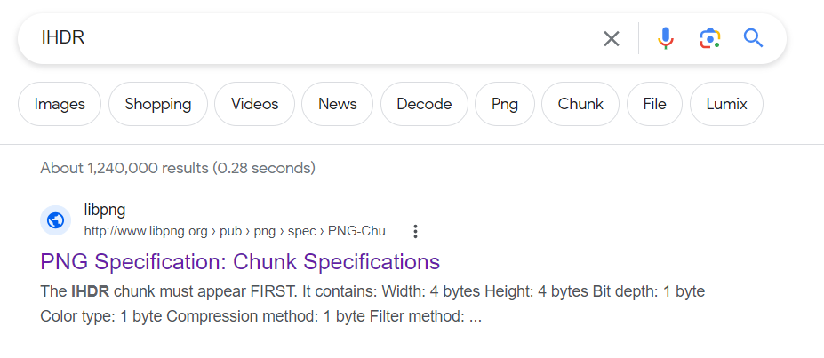
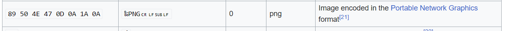
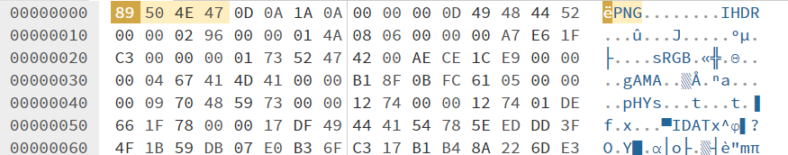

# Broken Images

Author: daffainfo

Category: Forensic

Flag: `HCS{f1X_tH3_iM4GE!!}`

## Description
Temanku mengirimiku gambar di pantai kemarin, namun ternyata foto yang dia kirim tidak terbaca

## Difficulty
Easy

## Solution
Jika diperhatikan kembali, hex pada header file ini cukuplah aneh yaitu `AA AA AA AA`. Sedangkan pada string selanjutnya terdapat string `IHDR`

Jika melakukan searching pada google, menandakan file ini adalah file gambar dengan ekstensi PNG namun headernya masih salah. Untuk melakukan recovering pada file ini, maka kita perlu merubah kembali header file menjadi semula menggunakan `Hex Editor`

Berdasarkan situs yang bisa ditemui di google (Pada kasus ini saya menggunakan https://en.wikipedia.org/wiki/List_of_file_signatures). Maka hex pada header file PNG yang benar adalah `89 50 4E 47`

Save file, dan kemudian buka kembali file yang sudah direcover untuk mendapatkan flag