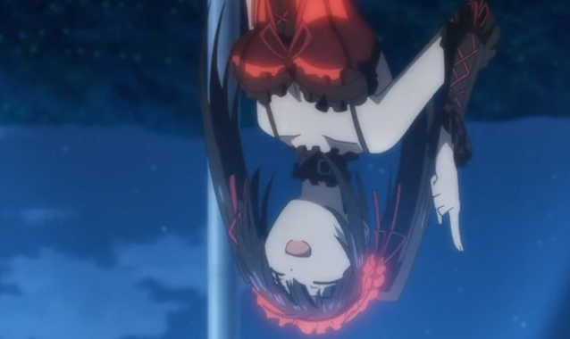

# Lend me your signature

Author: abdierryy

Category: Forensic

Flag: `HCS{N1c3_Th4ts_VerY_Ea5y_R1ghT????}`

## Description
Aku sedang dikirim gambar waifu oleh temanku, tapi sepertinya gambar tersebut tidak bisa dilihat. Tolong bantulah aku!

## Difficulty
Easy

## Solution

Pertama kita melakukan pengecheckan hex signature yang terdapat pada gambar

Berikut adalah signature pada bagian header dan footer

Signature tidak seperti pada umumnya oleh karena kita harus melakukan fix sesuai dengan yang seharusnya [PNG File Forensic](https://asecuritysite.com/forensics/png?file=%2Flog%2Fbasn0g01.png)

Setelah melakukan perubahan pada hex signature, maka selanjutnya akan terdapat gambar yg dapat dibuka seperti ini

Sepertinya dia menunjuk ke arah bawah, lalu untuk lebih jelas kita melakukan exiftool

Terdapat sebuah software yg dapat memanipulasi atau mengubah sebuah chunk dari sebuah gambar, jadi kita perlu mengubah chunk pada bagian bawah gambar yaitu height dengan menggunakan sedikit dorking kita menemukan software `TweakPNG`

Selanjutnya kita hanya perlu mengubah height dan akan terlihat flag